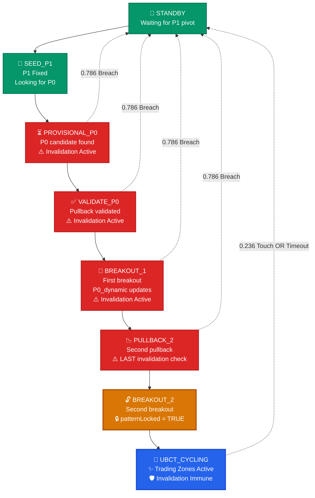
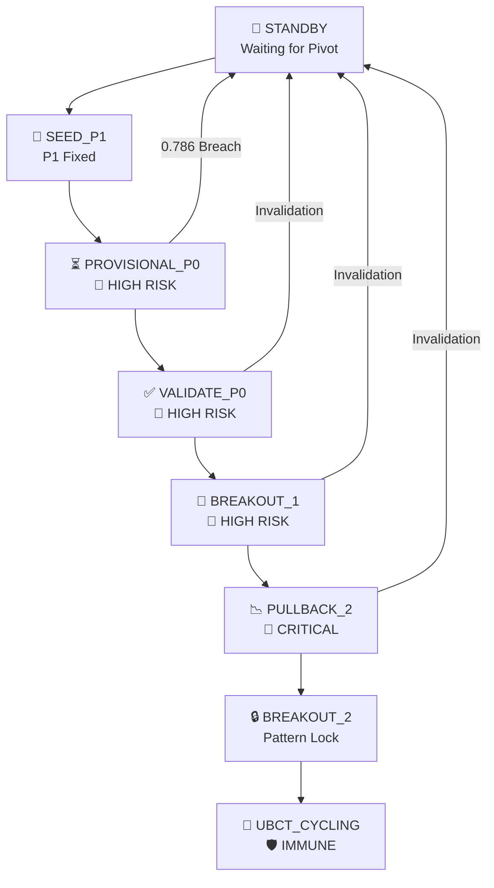

# Maverick UBCT Strategy Analysis & Workflow

## 🎯 Overview

The Maverick UBCT (Ultimate Breakout Continuation Trading) strategy has evolved through three major versions, culminating in a robust 8-state machine with pattern locking capabilities. This document provides a comprehensive analysis of the workflow, logic, and evolution.

---

## 🔄 The Full 8-State Workflow

The ultimate version (v3.x) implements a formal state machine that ensures robust pattern validation before activating UBCT cycling.

### State Flow Diagram



# 📈 MAVERICK UBCT State Progression & Price Action Flow

> **Advanced Pattern Recognition Algorithm** - Real-time market analysis with dynamic invalidation protection

---

## 🔄 State Machine Overview



---

## 📊 Detailed State Breakdown

### **State 1** | 🏁 STANDBY
```
Status: ⚪ Waiting
Risk:   🟢 None
```
- **Objective:** Detect initial swing pivot
- **Trigger:** First significant high/low formation
- **Output:** P1 coordinate establishment

---

### **State 2** | 🌱 SEED_P1
```
Status: 🔍 Scanning
Risk:   🟡 Low
```
- **Fixed:** `P1` anchor point locked
- **Scanning:** Opposite direction pivot (P0 candidate)
- **Logic:** Fibonacci-based validation zones active

---

### **State 3** | ⏳ PROVISIONAL_P0
```
Status: 🔴 HIGH RISK - Invalidation Active
Risk:   🔴 Critical (0.786 breach = reset)
```

#### Risk Management
| **Invalidation Level** | **Action** |
|------------------------|------------|
| 0.786 Fibonacci | → Return to STANDBY |
| Above P1 (if P0 is low) | → Pattern Reset |
| Below P1 (if P0 is high) | → Pattern Reset |

#### Fibonacci Validation Bands
```
P1 ████████████████████████████
    │
    ├─ 0.236 ████████████████████
    ├─ 0.382 ████████████████████ ← Entry consideration
    ├─ 0.618 ████████████████████ ← Primary validation
    └─ 0.786 ████████████████████ ← Invalidation level
                                │
                               P0 ♦♦♦♦♦
```

---

### **State 4** | ✅ VALIDATE_P0
```
Status: 🔴 HIGH RISK - Awaiting Breakout
Risk:   🔴 Critical
```

#### Confirmation Criteria
- [x] Pullback into 0.382-0.618 band completed
- [x] P0 candidate validated
- [ ] **Waiting:** First breakout beyond validation zone

#### Price Action Visualization
```
        P1 ████
           │ ╭─────────────────────╮
           ├─╢ ≈≈≈≈≈≈≈≈≈≈≈≈≈≈≈≈≈ ╟─ Validation Band
           │ ╰─────────┬───────────╯
           │           │
           │           ▼ 💥 BREAKOUT TARGET
           │          P0 ♦♦♦♦
```

---

### **State 5** | 🚀 BREAKOUT_1
```
Status: 🔴 HIGH RISK - Dynamic Updates
Risk:   🔴 Critical
```

#### Dynamic Behavior
- **P0_dynamic:** Updates with each new extreme
- **Fibonacci Bands:** Recalculate in real-time
- **Next Target:** Second pullback validation

#### Update Logic
```python
if new_extreme > current_P0_dynamic:
    P0_dynamic = new_extreme
    recalculate_fibonacci_levels()
```

---

### **State 6** | 📉 PULLBACK_2
```
Status: 🔴 CRITICAL - Last Invalidation Check
Risk:   ⚠️ Final validation phase
```

#### Critical Decision Point
> This is the **final opportunity** for pattern invalidation

#### Success Path
```
P1 ████     P0_dynamic ♦♦♦♦
   │ ╭─────────┴──────────╮
   ├─╢ ▓▓▓▓▓▓▓▓▓▓▓▓▓▓▓▓▓ ╟─ Breakout level
   │ ╰─────────┬──────────╯
   │           │
   │           ▼ 🔥 FINAL BREAKOUT
   │      ╭─────────╮
   └──────╢ ≈≈≈≈≈≈≈ ╟─ 2nd pullback zone
          ╰─────────╯
```

---

### **State 7** | 🔒 BREAKOUT_2
```
Status: 🔓➡️🔒 Pattern Locking Initiated
Risk:   🟡 Transitioning to Safe
```

#### Lock Sequence
1. **P0_dynamic** receives final update
2. **patternLocked** = `true`
3. **Fibonacci levels** freeze permanently
4. **Invalidation protection** activates

---

### **State 8** | 🎯 UBCT_CYCLING
```
Status: 🛡️ INVALIDATION IMMUNE
Risk:   🟢 Protected Trading Zone
```

#### Trading Zones
| **Zone** | **Purpose** | **Color Code** |
|----------|-------------|----------------|
| 🟦 **Operative Zone** | Primary trading area | `#2196F3` |
| 🟨 **Entry Zone** | Optimal entry points | `#FFC107` |

#### Zone Calculation
```
Operative Zone: P1 to 0.618 retracement of P1-P0_dynamic
Entry Zone:     0.618 to 0.786 retracement of P1-P0_dynamic
```

#### Exit Conditions
- **0.236 Fibonacci Touch:** Signal exhaustion
- **No Pivot Bars Timeout:** Pattern completion
- **Manual Override:** Risk management

---

## 🔧 Technical Implementation

### Core Parameters
```yaml
invalidation_threshold: 0.786
validation_band: [0.382, 0.618]
entry_zone: [0.618, 0.786]
operative_zone: [0.236, 0.618]
pivot_detection_sensitivity: 3  # bars
```

### Risk Levels
| Risk | States | Color | Action |
|------|--------|-------|--------|
| 🟢 **Safe** | STANDBY, UBCT_CYCLING | Green | Full trading |
| 🟡 **Low** | SEED_P1, BREAKOUT_2 | Yellow | Cautious |
| 🔴 **High** | PROVISIONAL_P0, VALIDATE_P0, BREAKOUT_1 | Red | Minimal exposure |
| ⚠️ **Critical** | PULLBACK_2 | Orange | Emergency protocols |

---

## 📋 Quick Reference

### State Transitions
```
STANDBY → SEED_P1 → PROVISIONAL_P0 → VALIDATE_P0 → BREAKOUT_1 → PULLBACK_2 → BREAKOUT_2 → UBCT_CYCLING
    ↑         ↑            ↑              ↑            ↑            ↑
    └─────────┴────────────┴──────────────┴────────────┴────────────┘
                        (Invalidation paths)
```

### Legend
- `████` **P1_fixed** - Immutable anchor point
- `♦♦♦♦` **P0_dynamic** - Updates until lock
- `≈≈≈≈` **Fibonacci bands** - Validation zones  
- `▓▓▓▓` **Breakout levels** - Action triggers
- 🔴 **Invalidation risk** - Pattern can reset
- 🛡️ **Invalidation immune** - Protected state

---

*Built with precision for high-frequency pattern recognition and risk management.*
```

### Invalidation Risk Heatmap

```
State Risk Level:
🟢 STANDBY       ████▓ No Risk (Safe Zone)
🟢 SEED_P1       ████▓ No Risk (Safe Zone)
🔴 PROVISIONAL_P0 █████ High Risk (0.786 breach = RESET)
🔴 VALIDATE_P0    █████ High Risk (0.786 breach = RESET)
🔴 BREAKOUT_1     █████ High Risk (0.786 breach = RESET)  
🔴 PULLBACK_2     █████ High Risk (LAST chance for reset)
🟠 BREAKOUT_2     █▓▓▓▓ Protected (Pattern Locking Active)
🔵 UBCT_CYCLING   ▓▓▓▓▓ Immune (Fully Protected Zone)

Legend: █ = Risk Level, ▓ = Protected Level
Colors: 🔴 Red=Danger 🟠 Orange=Locking 🟢 Green=Safe 🔵 Blue=Active
```

### Detailed State Breakdown

| State | Description | Key Actions | Invalidation Active |
|-------|-------------|-------------|-------------------|
| **STANDBY** | 🏁 Initial state | Waiting for P1 pivot (swing high/low) | ❌ No |
| **SEED_P1** | 🌱 P1 established | P1 is fixed, looking for P0 candidate | ❌ No |
| **PROVISIONAL_P0** | ⏳ P0 candidate found | Waiting for pullback into 0.382-0.618 band | ✅ Yes |
| **VALIDATE_P0** | ✅ P0 confirmed | Pullback occurred, waiting for first breakout | ✅ Yes |
| **BREAKOUT_1** | 🚀 First breakout | P0_dynamic updates, waiting for second pullback | ✅ Yes |
| **PULLBACK_2** | 📉 Second pullback | **LAST STATE** with invalidation checking | ✅ Yes |
| **BREAKOUT_2** | 🔓 Second breakout | P0_dynamic final update, **patternLocked = true** | ❌ No |
| **UBCT_CYCLING** | 🎯 Active trading | Operative & Entry zones active, invalidation-immune | ❌ No |

---

## 🔒 Pattern Locking Mechanism

### Critical Innovation: `patternLocked` Variable

```javascript
// In BREAKOUT_2 state
patternLocked := true
```

This boolean variable is the **most significant improvement** in v3.x:

- **Activated**: After successful completion of BREAKOUT_2
- **Effect**: Disables `hasBreachedInvalidation()` function
- **Purpose**: Prevents erroneous cancellations of mature UBCT patterns
- **Result**: UBCT_CYCLING becomes invalidation-immune

---

## ⚠️ Invalidation Logic

### Function: `hasBreachedInvalidation()`

**Active States**: PROVISIONAL_P0, VALIDATE_P0, BREAKOUT_1, PULLBACK_2

**Trigger Condition**: Current or historical breach of 0.786 Fibonacci level

**Action**: Complete pattern reset to STANDBY state, clearing:
- `P1_fixed`
- `P0_dynamic` 
- All historical data

### Invalidation Timeline

```
PROVISIONAL_P0 ──┐
VALIDATE_P0 ─────┼─── Invalidation Active (0.786 breach = RESET)
BREAKOUT_1 ──────┤
PULLBACK_2 ──────┘
BREAKOUT_2 ──────── Pattern Locked 🔒 (No more invalidation)
UBCT_CYCLING ──── Invalidation Immune ✨
```

---

## 📊 Zone Calculations & Visibility

### Key Variables
- **P1_fixed**: Anchored pivot point (swing high/low)
- **P0_dynamic**: Updates through breakouts
- **rangeValue (H)**: Price range calculation

### Zone Formulas
```
operativeLower = calcFibPrice(P1_fixed, P0_dynamic, operativeLevel)
operativeUpper = calcFibPrice(P1_fixed, P0_dynamic, operativeLevel)
entryLower = calcFibPrice(P1_fixed, P0_dynamic, entryLevel)
entryUpper = calcFibPrice(P1_fixed, P0_dynamic, entryLevel)
```

### Zone Visibility Logic
**Operative & Entry Zones** are visible **ONLY** when:
- `currentState == BREAKOUT_2` OR
- `currentState == UBCT_CYCLING`

---

## 📈 Version Evolution Comparison

| Feature | v1 (Basic) | v2 (State Start) | v3.x (Full State Machine) |
|---------|------------|------------------|---------------------------|
| **UBCT Activation** | `isLong/Short AND not standByState` | `isLong/Short AND not standByState` | Explicit `UBCT_CYCLING` state |
| **State Machine** | ❌ No formal states | 3 states: STANDBY, EARLY_PHASE, ESTABLISHED_PHASE | 8 formal states |
| **P1 Management** | ✅ Conceptual | ✅ Conceptual | ✅ `P1_fixed` variable |
| **P0 Management** | ✅ recentHigh/Low based | ✅ recentHigh/Low based | ✅ `P0_dynamic` updates |
| **Invalidation Scope** | Current bar only | Current + historical | Current + historical |
| **Invalidation in UBCT** | ✅ Always active | ✅ Always active | ❌ **Pattern Locked** |
| **Pattern Lock** | ❌ No concept | ❌ No concept | ✅ **`patternLocked` boolean** |
| **Zone Visibility** | `showZones AND not na(zones)` | `showZones AND not invalidationDetected` | Tied to `BREAKOUT_2` or `UBCT_CYCLING` |

---

## 🎯 Key Improvements in v3.x

### 1. **Formal State Machine**
- Provides rigid, predictable pattern development
- Clear progression through validation steps
- Eliminates ambiguous state transitions

### 2. **Pattern Locking System**
- **Critical Feature**: `patternLocked = true` after BREAKOUT_2
- Prevents mature patterns from being invalidated
- Solves the "erroneous cancellation" bug

### 3. **Protected UBCT Cycling**
- Only accessible after complete validation sequence
- Immune to 0.786 invalidation breaches
- Reliable "Go Phase" for trading

### 4. **Enhanced Zone Management**
- Clear visibility rules tied to specific states
- Prevents premature zone display
- Ensures zones only appear when pattern is mature

---

## 🔄 Exit Conditions from UBCT_CYCLING

The pattern can exit UBCT_CYCLING through:

1. **Cycle End Trigger**: Price touches the 0.236 copy level
2. **Timeout**: `noPivotBarsForStandby` threshold reached

---

## 🐛 Debug Workflow Checklist

### State Transition Verification
- [ ] STANDBY → SEED_P1: P1 pivot detected
- [ ] SEED_P1 → PROVISIONAL_P0: P0 candidate found
- [ ] PROVISIONAL_P0 → VALIDATE_P0: Pullback to 0.382-0.618 band
- [ ] VALIDATE_P0 → BREAKOUT_1: First breakout past P0
- [ ] BREAKOUT_1 → PULLBACK_2: Second pullback validated
- [ ] PULLBACK_2 → BREAKOUT_2: Second breakout confirmed
- [ ] BREAKOUT_2 → UBCT_CYCLING: Pattern locked and cycling active

### Critical Variables
- [ ] `P1_fixed`: Properly anchored pivot
- [ ] `P0_dynamic`: Updates correctly through breakouts
- [ ] `patternLocked`: Set to `true` in BREAKOUT_2
- [ ] `currentState`: Accurate state tracking
- [ ] Zone calculations: Proper Fibonacci levels

### Common Issues
- **Premature Invalidation**: Check if `patternLocked` is working
- **Missing Zones**: Verify state is BREAKOUT_2 or UBCT_CYCLING
- **Pattern Reset**: Look for 0.786 breaches in early states
- **State Stuck**: Confirm transition conditions are met

---

## 🎯 Conclusion

The v3.x Maverick UBCT represents a significant evolution from basic pattern recognition to a sophisticated, protected trading system. The introduction of the pattern locking mechanism ensures that once a UBCT pattern has been fully validated through all 8 states, it becomes immune to invalidation, providing traders with a reliable and robust continuation pattern strategy.

The formal state machine approach eliminates ambiguity and provides clear debugging pathways, making the system both more reliable and easier to maintain.
