# Maverick UBCT Strategy Analysis & Workflow

## 🎯 Overview

The Maverick UBCT (Ultimate Breakout Continuation Trading) strategy has evolved through three major versions, culminating in a robust 8-state machine with pattern locking capabilities. This document provides a comprehensive analysis of the workflow, logic, and evolution.

---

## 🔄 The Full 8-State Workflow

The ultimate version (v3.x) implements a formal state machine that ensures robust pattern validation before activating UBCT cycling.

### State Flow Diagram

```mermaid
flowchart TD
    A[🏁 STANDBY<br/>Waiting for P1 pivot] --> B[🌱 SEED_P1<br/>P1 Fixed<br/>Looking for P0]
    B --> C[⏳ PROVISIONAL_P0<br/>P0 candidate found<br/>⚠️ Invalidation Active]
    C --> D[✅ VALIDATE_P0<br/>Pullback validated<br/>⚠️ Invalidation Active]
    D --> E[🚀 BREAKOUT_1<br/>First breakout<br/>P0_dynamic updates<br/>⚠️ Invalidation Active]
    E --> F[📉 PULLBACK_2<br/>Second pullback<br/>⚠️ LAST invalidation check]
    F --> G[🔓 BREAKOUT_2<br/>Second breakout<br/>🔒 patternLocked = TRUE]
    G --> H[🎯 UBCT_CYCLING<br/>✨ Trading Zones Active<br/>🛡️ Invalidation Immune]
    
    %% Invalidation paths (red dashed lines)
    C -.->|0.786 Breach| A
    D -.->|0.786 Breach| A  
    E -.->|0.786 Breach| A
    F -.->|0.786 Breach| A
    
    %% Exit conditions
    H -.->|0.236 Touch OR Timeout| A
    
    %% Styling
    classDef danger fill:#ff9999,stroke:#ff0000,stroke-width:2px
    classDef safe fill:#99ff99,stroke:#00aa00,stroke-width:2px
    classDef locked fill:#ffcc99,stroke:#ff8800,stroke-width:3px
    classDef active fill:#99ccff,stroke:#0066cc,stroke-width:3px
    
    class C,D,E,F danger
    class A,B safe
    class G locked
    class H active
```



### Visual Price Action Representation

```
📈 Price Movement Through States:

STANDBY ──────────────────────────────
   │                                  
   └─→ P1 Pivot Found ●              
                                      
SEED_P1 ──────────────────────────────
   │                                  
   └─→ Looking for P0 candidate       
                                      
PROVISIONAL_P0 ───────────────────────
   │                    ●─── P0       
   │                   ╱              
   └─→ Wait for ──────╱ pullback      
       0.382-0.618 validation         
                                      
VALIDATE_P0 ──────────────────────────
   │     ●─────────● P0 confirmed     
   │    ╱         ╲                   
   └──╱            ╲                  
      │             │                 
   Pullback     First Breakout        
   Validated    ──────────────→       
                                      
BREAKOUT_1 ───────────────────────────
   │                  ●───────● P0_dynamic
   │                 ╱         ╲      
   └─→ Wait for ────╱           ╲     
       second pullback          │     
                               ╱      
PULLBACK_2 ──────────────────╱───────
   │              ●                  
   │             ╱ │                  
   └─→ Second ──╱  │ ⚠️ LAST          
       pullback    │ invalidation     
                   │ check            
                   ▼                  
BREAKOUT_2 ────────●──────────────────
   │               │ 🔒 PATTERN       
   └─→ P0_dynamic  │    LOCKED        
       final update│                  
                   ▼                  
UBCT_CYCLING ──────●──────────────────
       🎯 TRADING ZONES ACTIVE        
       🛡️ INVALIDATION IMMUNE         
```

### Invalidation Risk Heatmap

```
State Risk Level:
🟢 STANDBY       ■■□□□ No Risk
🟢 SEED_P1       ■■□□□ No Risk  
🔴 PROVISIONAL_P0 ■■■■■ High Risk (0.786 breach = RESET)
🔴 VALIDATE_P0    ■■■■■ High Risk (0.786 breach = RESET)
🔴 BREAKOUT_1     ■■■■■ High Risk (0.786 breach = RESET)  
🔴 PULLBACK_2     ■■■■■ High Risk (LAST chance for reset)
🟡 BREAKOUT_2     ■□□□□ Protected (Pattern Locking)
🟢 UBCT_CYCLING   □□□□□ Immune (Fully Protected)
```

### Detailed State Breakdown

| State | Description | Key Actions | Invalidation Active |
|-------|-------------|-------------|-------------------|
| **STANDBY** | 🏁 Initial state | Waiting for P1 pivot (swing high/low) | ❌ No |
| **SEED_P1** | 🌱 P1 established | P1 is fixed, looking for P0 candidate | ❌ No |
| **PROVISIONAL_P0** | ⏳ P0 candidate found | Waiting for pullback into 0.382-0.618 band | ✅ Yes |
| **VALIDATE_P0** | ✅ P0 confirmed | Pullback occurred, waiting for first breakout | ✅ Yes |
| **BREAKOUT_1** | 🚀 First breakout | P0_dynamic updates, waiting for second pullback | ✅ Yes |
| **PULLBACK_2** | 📉 Second pullback | **LAST STATE** with invalidation checking | ✅ Yes |
| **BREAKOUT_2** | 🔓 Second breakout | P0_dynamic final update, **patternLocked = true** | ❌ No |
| **UBCT_CYCLING** | 🎯 Active trading | Operative & Entry zones active, invalidation-immune | ❌ No |

---

## 🔒 Pattern Locking Mechanism

### Critical Innovation: `patternLocked` Variable

```javascript
// In BREAKOUT_2 state
patternLocked := true
```

This boolean variable is the **most significant improvement** in v3.x:

- **Activated**: After successful completion of BREAKOUT_2
- **Effect**: Disables `hasBreachedInvalidation()` function
- **Purpose**: Prevents erroneous cancellations of mature UBCT patterns
- **Result**: UBCT_CYCLING becomes invalidation-immune

---

## ⚠️ Invalidation Logic

### Function: `hasBreachedInvalidation()`

**Active States**: PROVISIONAL_P0, VALIDATE_P0, BREAKOUT_1, PULLBACK_2

**Trigger Condition**: Current or historical breach of 0.786 Fibonacci level

**Action**: Complete pattern reset to STANDBY state, clearing:
- `P1_fixed`
- `P0_dynamic` 
- All historical data

### Invalidation Timeline

```
PROVISIONAL_P0 ──┐
VALIDATE_P0 ─────┼─── Invalidation Active (0.786 breach = RESET)
BREAKOUT_1 ──────┤
PULLBACK_2 ──────┘
BREAKOUT_2 ──────── Pattern Locked 🔒 (No more invalidation)
UBCT_CYCLING ──── Invalidation Immune ✨
```

---

## 📊 Zone Calculations & Visibility

### Key Variables
- **P1_fixed**: Anchored pivot point (swing high/low)
- **P0_dynamic**: Updates through breakouts
- **rangeValue (H)**: Price range calculation

### Zone Formulas
```
operativeLower = calcFibPrice(P1_fixed, P0_dynamic, operativeLevel)
operativeUpper = calcFibPrice(P1_fixed, P0_dynamic, operativeLevel)
entryLower = calcFibPrice(P1_fixed, P0_dynamic, entryLevel)
entryUpper = calcFibPrice(P1_fixed, P0_dynamic, entryLevel)
```

### Zone Visibility Logic
**Operative & Entry Zones** are visible **ONLY** when:
- `currentState == BREAKOUT_2` OR
- `currentState == UBCT_CYCLING`

---

## 📈 Version Evolution Comparison

| Feature | v1 (Basic) | v2 (State Start) | v3.x (Full State Machine) |
|---------|------------|------------------|---------------------------|
| **UBCT Activation** | `isLong/Short AND not standByState` | `isLong/Short AND not standByState` | Explicit `UBCT_CYCLING` state |
| **State Machine** | ❌ No formal states | 3 states: STANDBY, EARLY_PHASE, ESTABLISHED_PHASE | 8 formal states |
| **P1 Management** | ✅ Conceptual | ✅ Conceptual | ✅ `P1_fixed` variable |
| **P0 Management** | ✅ recentHigh/Low based | ✅ recentHigh/Low based | ✅ `P0_dynamic` updates |
| **Invalidation Scope** | Current bar only | Current + historical | Current + historical |
| **Invalidation in UBCT** | ✅ Always active | ✅ Always active | ❌ **Pattern Locked** |
| **Pattern Lock** | ❌ No concept | ❌ No concept | ✅ **`patternLocked` boolean** |
| **Zone Visibility** | `showZones AND not na(zones)` | `showZones AND not invalidationDetected` | Tied to `BREAKOUT_2` or `UBCT_CYCLING` |

---

## 🎯 Key Improvements in v3.x

### 1. **Formal State Machine**
- Provides rigid, predictable pattern development
- Clear progression through validation steps
- Eliminates ambiguous state transitions

### 2. **Pattern Locking System**
- **Critical Feature**: `patternLocked = true` after BREAKOUT_2
- Prevents mature patterns from being invalidated
- Solves the "erroneous cancellation" bug

### 3. **Protected UBCT Cycling**
- Only accessible after complete validation sequence
- Immune to 0.786 invalidation breaches
- Reliable "Go Phase" for trading

### 4. **Enhanced Zone Management**
- Clear visibility rules tied to specific states
- Prevents premature zone display
- Ensures zones only appear when pattern is mature

---

## 🔄 Exit Conditions from UBCT_CYCLING

The pattern can exit UBCT_CYCLING through:

1. **Cycle End Trigger**: Price touches the 0.236 copy level
2. **Timeout**: `noPivotBarsForStandby` threshold reached

---

## 🐛 Debug Workflow Checklist

### State Transition Verification
- [ ] STANDBY → SEED_P1: P1 pivot detected
- [ ] SEED_P1 → PROVISIONAL_P0: P0 candidate found
- [ ] PROVISIONAL_P0 → VALIDATE_P0: Pullback to 0.382-0.618 band
- [ ] VALIDATE_P0 → BREAKOUT_1: First breakout past P0
- [ ] BREAKOUT_1 → PULLBACK_2: Second pullback validated
- [ ] PULLBACK_2 → BREAKOUT_2: Second breakout confirmed
- [ ] BREAKOUT_2 → UBCT_CYCLING: Pattern locked and cycling active

### Critical Variables
- [ ] `P1_fixed`: Properly anchored pivot
- [ ] `P0_dynamic`: Updates correctly through breakouts
- [ ] `patternLocked`: Set to `true` in BREAKOUT_2
- [ ] `currentState`: Accurate state tracking
- [ ] Zone calculations: Proper Fibonacci levels

### Common Issues
- **Premature Invalidation**: Check if `patternLocked` is working
- **Missing Zones**: Verify state is BREAKOUT_2 or UBCT_CYCLING
- **Pattern Reset**: Look for 0.786 breaches in early states
- **State Stuck**: Confirm transition conditions are met

---

## 🎯 Conclusion

The v3.x Maverick UBCT represents a significant evolution from basic pattern recognition to a sophisticated, protected trading system. The introduction of the pattern locking mechanism ensures that once a UBCT pattern has been fully validated through all 8 states, it becomes immune to invalidation, providing traders with a reliable and robust continuation pattern strategy.

The formal state machine approach eliminates ambiguity and provides clear debugging pathways, making the system both more reliable and easier to maintain.
