# Maverick UBCT Strategy Analysis & Workflow
## v4: Early Invalidation Lock Enhancement

## 🎯 Overview

The Maverick UBCT (Ultimate Breakout Continuation Trading) strategy has evolved through four major versions, culminating in the revolutionary **Early Invalidation Lock** mechanism. This v4 enhancement introduces dynamic bias confirmation that can disable invalidation checks before the traditional BREAKOUT_2 state, significantly improving pattern reliability and reducing false negatives.

---

## 🔄 The Enhanced 8-State Workflow (v4 with Early Lock)

The refined version implements a sophisticated state machine with **conditional invalidation** based on real-time price action confirmation.

### Advanced State Flow Diagram

```mermaid
flowchart TD
    A[🏁 STANDBY<br/>Waiting for P1 pivot] --> B[🌱 SEED_P1<br/>P1 Fixed<br/>Looking for P0]
    B --> C[⏳ PROVISIONAL_P0<br/>P0 candidate found<br/>⚠️ Invalidation Active]
    C --> D[✅ VALIDATE_P0<br/>Pullback validated<br/>⚠️ Invalidation Active]
    D --> E[🚀 BREAKOUT_1<br/>First breakout<br/>📊 Capture breakout1Level<br/>⚠️ Invalidation Active]
    E --> F[📉 PULLBACK_2<br/>Second pullback<br/>⚡ CONDITIONAL Invalidation]
    F --> G[🔓 BREAKOUT_2<br/>Second breakout<br/>🔒 patternLocked = TRUE]
    G --> H[🎯 UBCT_CYCLING<br/>✨ Trading Zones Active<br/>🛡️ Invalidation Immune]
    
    %% Traditional Invalidation paths (red dashed lines)
    C -.->|0.786 Breach| A
    D -.->|0.786 Breach| A  
    E -.->|0.786 Breach| A
    F -.->|0.786 Breach<br/>IF NOT Early Locked| A
    
    %% Early Invalidation Lock Innovation (purple)
    E -->|Store breakout1Level| EL[📊 breakout1Level<br/>Captured]
    F -->|Price crosses<br/>breakout1Level<br/>✨ EARLY LOCK ✨| FL[🛡️ earlyInvalidationLock<br/>= TRUE]
    FL -.-> F
    
    %% Exit conditions
    H -.->|0.236 Touch OR Timeout| A
    
    %% Styling - High contrast colors for dark/light mode compatibility
    classDef danger fill:#dc2626,stroke:#b91c1c,stroke-width:2px,color:#ffffff
    classDef safe fill:#059669,stroke:#047857,stroke-width:2px,color:#ffffff
    classDef locked fill:#d97706,stroke:#b45309,stroke-width:3px,color:#ffffff
    classDef active fill:#2563eb,stroke:#1d4ed8,stroke-width:3px,color:#ffffff
    classDef innovation fill:#8b5cf6,stroke:#7c3aed,stroke-width:2px,color:#ffffff
    
    class C,D,E danger
    class F danger
    class A,B safe
    class G locked
    class H active
    class EL,FL innovation
```



---

## 🚀 Revolutionary Feature: Early Invalidation Lock

### Core Innovation
The **Early Invalidation Lock** represents a paradigm shift from rigid state-based protection to **dynamic price action validation**.

#### Mechanism Overview
```
Traditional v3: Invalidation active until BREAKOUT_2
         v4: Invalidation can be disabled in PULLBACK_2 based on price action
```

#### Trigger Logic
```javascript
// In PULLBACK_2 state
if (price crosses breakout1Level) {
    earlyInvalidationLock = true
    // 0.786 invalidation now DISABLED
    // Pattern protected early!
}
```

### Visual Representation of Early Lock

```
📊 EARLY INVALIDATION LOCK MECHANISM

Stage 1: BREAKOUT_1 - Capture Reference Level
┌─────────────────────────────────────────────────┐
│ P1 ████████████████ (Fixed Anchor)              │
│     │                                           │
│     │    ╔═══════════════════════════════════╗  │
│     └────║ ▲▲▲▲▲▲▲▲▲ BREAKOUT_1 ▲▲▲▲▲▲▲▲▲ ║  │
│          ║           │                      ║  │
│          ║           ▼ P0_dynamic ♦♦♦♦♦♦♦♦ ║  │
│          ╚═══════════════════════════════════╝  │
│                      │                         │
│          📊 STORE: breakout1Level = P0_dynamic │
└─────────────────────────────────────────────────┘

Stage 2: PULLBACK_2 - Early Lock Detection  
┌─────────────────────────────────────────────────┐
│ P1 ████████████████                             │
│     │                                           │
│     │    breakout1Level ▓▓▓▓▓▓▓▓ (Reference)    │
│     │           │                               │
│     │           ▼ Price Action                  │
│     │      ╭─────────╮                         │
│     └──────╢ ≈≈≈≈≈≈≈ ╟─ 2nd Pullback Zone     │
│            ╰─────┬───╯                         │
│                  │                             │
│            ✨ IF: Price crosses breakout1Level │
│            🛡️ THEN: earlyInvalidationLock = TRUE│
└─────────────────────────────────────────────────┘
```

---

## 📊 Enhanced State Breakdown

### State 0: 🏁 STANDBY
| Attribute | Value |
|-----------|--------|
| **Status** | ⚪ Waiting |
| **Risk** | 🟢 None |
| **Objective** | Detect initial swing pivot |
| **Trigger** | First significant high/low formation |
| **Output** | P1 coordinate establishment |

### State 1: 🌱 SEED_P1  
| Attribute | Value |
|-----------|--------|
| **Status** | 🔍 Scanning |
| **Risk** | 🟡 Low |
| **Fixed** | P1 anchor point locked |
| **Scanning** | Opposite direction pivot (P0 candidate) |
| **Logic** | Fibonacci validation zones inactive |

### State 2: ⏳ PROVISIONAL_P0
| Attribute | Value |
|-----------|--------|
| **Status** | 🔴 HIGH RISK - Invalidation Active |
| **Risk** | 🔴 Critical (0.786 breach = reset) |
| **Objective** | Price pulls back into validation band |
| **Trigger** | Close enters 0.382-0.618 Fibonacci band |
| **Output** | P0 candidate validated |

#### Risk Management Matrix
| Invalidation Level | Action | Check Type |
|-------------------|--------|------------|
| **0.786 Fibonacci** | → Return to STANDBY | Current + Historical |
| **Historical Breach** | → Pattern Reset | Lookback validation |

### State 3: ✅ VALIDATE_P0
| Attribute | Value |
|-----------|--------|
| **Status** | 🔴 HIGH RISK - Awaiting Breakout |
| **Risk** | 🔴 Critical |
| **Objective** | Price breaks beyond P0 |
| **Trigger** | New swing high/low beyond P0_dynamic |
| **Output** | First breakout confirmed |

#### Confirmation Criteria
- [x] Pullback into 0.382-0.618 band completed
- [x] P0 candidate validated  
- [ ] **Waiting**: First breakout beyond validation zone

### State 4: 🚀 BREAKOUT_1 (Enhanced with Level Capture)
| Attribute | Value |
|-----------|--------|
| **Status** | 🔴 HIGH RISK - Dynamic Updates + **Level Capture** |
| **Risk** | 🔴 Critical |
| **Innovation** | 📊 **Store breakout1Level = P0_dynamic** |
| **Objective** | Await second pullback |
| **Trigger** | Close enters 0.382-0.618 band |

#### Dynamic Update Logic
```javascript
if (new_extreme > current_P0_dynamic) {
    P0_dynamic = new_extreme
    breakout1Level = P0_dynamic  // 🆕 CAPTURE REFERENCE
    recalculate_fibonacci_levels()
}
```

### State 5: 📉 PULLBACK_2 (Revolutionary Enhancement)
| Attribute | Value |
|-----------|--------|
| **Status** | ⚡ CONDITIONAL Invalidation Check |
| **Risk** | ⚠️ **Dynamic** (Can become protected early) |
| **Innovation** | 🛡️ **Early Invalidation Lock** |
| **Conditions** | Traditional OR Early Protection |

#### Critical Decision Matrix

| Scenario | Condition | Invalidation Status | Next State |
|----------|-----------|-------------------|------------|
| **Standard Path** | No early lock trigger | 🔴 Active (0.786 check) | BREAKOUT_2 |
| **Early Lock Path** | Price crosses breakout1Level | 🛡️ **DISABLED** | BREAKOUT_2 |
| **Invalidation Hit** | 0.786 breach + no early lock | ❌ Pattern Reset | STANDBY |

#### Early Lock Trigger Logic
```javascript
// In PULLISH pattern
if (current_high > breakout1Level) {
    earlyInvalidationLock = true
    // Invalidation protection activated!
}

// In BEARISH pattern  
if (current_low < breakout1Level) {
    earlyInvalidationLock = true
    // Invalidation protection activated!
}
```

### State 6: 🔓 BREAKOUT_2 (Traditional Lock)
| Attribute | Value |
|-----------|--------|
| **Status** | 🔒 Pattern Locking |
| **Risk** | ❌ None |
| **Action** | `patternLocked = TRUE` |
| **Result** | Traditional invalidation immunity |

### State 7: 🎯 UBCT_CYCLING (Active Trading)
| Attribute | Value |
|-----------|--------|
| **Status** | 🛡️ Fully Protected |
| **Zones** | 🟦 Operative + 🟨 Entry Active |
| **Immunity** | Complete invalidation immunity |
| **Exit** | 0.236 touch OR timeout |

---

## 📈 Version Evolution Comparison

| Feature | v1 (Basic) | v2 (State Start) | v3 (Full Machine) | v4 (Early Lock) |
|---------|------------|------------------|------------------|-----------------|
| **State Machine** | ❌ Basic | 3 States | 8 States | 8 States Enhanced |
| **Invalidation Scope** | Current only | Current + Historical | Current + Historical | **Conditional** |
| **Pattern Lock** | ❌ None | ❌ None | BREAKOUT_2 only | **PULLBACK_2 + BREAKOUT_2** |
| **Early Protection** | ❌ None | ❌ None | ❌ None | ✅ **breakout1Level trigger** |
| **Bias Confirmation** | ❌ Basic | ❌ Basic | ❌ Basic | ✅ **Dynamic price action** |
| **False Negatives** | High | Medium | Low | **Minimal** |

---

## 🎯 Strategic Advantages of v4

### 1. **Reduced False Negatives**
- Earlier pattern protection when price action confirms bias
- Prevents premature invalidation of strong patterns
- More responsive to market momentum

### 2. **Dynamic Bias Validation**  
- Real-time confirmation via breakout1Level crossings
- Market-driven protection rather than rigid state-based
- Adapts to varying market volatility

### 3. **Enhanced Reliability**
- Dual protection mechanisms (Early + Traditional)
- Conditional invalidation based on price behavior
- Stronger pattern maturation process

### 4. **Improved Performance**
- Faster pattern recognition and protection
- Reduced whipsaw effects in volatile markets
- Better adaptation to different timeframes

---

## 🔄 Exit Conditions from UBCT_CYCLING

| Condition | Action | Result |
|-----------|--------|--------|
| **0.236 Fibonacci Touch** | Cycle end trigger | → STANDBY |
| **No Pivot Bars Timeout** | Pattern expiration | → STANDBY |
| **Manual Override** | User intervention | → STANDBY |

---

## 🐛 Enhanced Debug Workflow Checklist

### Early Invalidation Lock Verification
- [ ] **breakout1Level captured** in BREAKOUT_1
- [ ] **Price crossing detection** working in PULLBACK_2  
- [ ] **earlyInvalidationLock flag** properly set
- [ ] **Invalidation bypass** active when early locked

### State Transition Verification  
- [ ] STANDBY → SEED_P1: P1 pivot detection
- [ ] SEED_P1 → PROVISIONAL_P0: P0 candidate identification
- [ ] PROVISIONAL_P0 → VALIDATE_P0: Validation band entry
- [ ] VALIDATE_P0 → BREAKOUT_1: First breakout + level capture
- [ ] BREAKOUT_1 → PULLBACK_2: Second pullback + early lock check
- [ ] PULLBACK_2 → BREAKOUT_2: Traditional or early-protected transition
- [ ] BREAKOUT_2 → UBCT_CYCLING: Final pattern lock

### Critical Variables Monitoring
- [ ] `P1_fixed`: Stable anchor point
- [ ] `P0_dynamic`: Proper updates through breakouts
- [ ] `breakout1Level`: Correct capture in BREAKOUT_1
- [ ] `earlyInvalidationLock`: Dynamic flag status
- [ ] `patternLocked`: Traditional lock in BREAKOUT_2
- [ ] `currentState`: Accurate progression tracking

### Common Issues & Solutions
- **Early Lock Not Triggering**: Verify breakout1Level calculation
- **False Early Locks**: Check price crossing logic accuracy  
- **Pattern Still Invalidating**: Confirm earlyInvalidationLock flag usage
- **Missing Level Capture**: Validate BREAKOUT_1 P0_dynamic storage

---

## 🎯 Conclusion

The v4 Maverick UBCT with **Early Invalidation Lock** represents a quantum leap in pattern recognition sophistication. By introducing **dynamic bias confirmation** through the breakout1Level mechanism, the strategy can now protect patterns based on real-time price action rather than rigid state progression alone.

This innovation significantly reduces false negatives while maintaining the robust validation framework that made previous versions reliable. The result is a more responsive, market-adaptive, and accurate continuation pattern strategy that excels across various market conditions and timeframes.

The dual protection system (Early Lock + Traditional Lock) ensures maximum pattern reliability while the conditional invalidation approach prevents premature pattern termination during strong trending moves.
